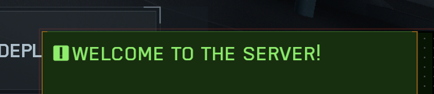

# OnPlayerJoinGame

This function triggers when a player joins the game. This is useful for initializing player-specific data, sending welcome messages, or setting up initial game state for new players.

## Syntax

```typescript
export function OnPlayerJoinGame(eventPlayer: mod.Player): void;
```

## Parameters

| Parameter     | Type         | Description                    |
| ------------- | ------------ | ------------------------------ |
| `eventPlayer` | `mod.Player` | The player who joined the game |

## Example

=== "Script.ts"
    ```typescript
    export async function OnPlayerJoinGame(eventPlayer: mod.Player) {
      console.log("Player joined the game");
      
      // Wait to make sure the player has loaded.
      await mod.Wait(10);
      
      // Display a welcome message to the joining player
      const welcomeMsg = mod.Message(mod.stringkeys.welcome);
      mod.DisplayNotificationMessage(welcomeMsg, eventPlayer);
    }
    ```
=== "Strings.json"
    ```json
    {
      "welcome": "Welcome to the server!"
    }
    ```



## See Also

- [`OnPlayerLeaveGame`](./OnPlayerLeaveGame.md)
- [`OnPlayerSwitchTeam`](./OnPlayerSwitchTeam.md)
