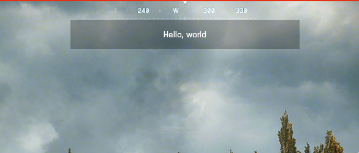

# SetUIWidgetVisible

This function determines whether a UI Widget is visible or not. Use this to show or hide UI elements dynamically during gameplay. [ui_builder](https://github.com/battlefield-portal-community/ui_builder) is a tool that can be used to design UIs visually.

## Syntax

```typescript
export function SetUIWidgetVisible(widget: UIWidget, visible: boolean): void;
```

## Parameters

| Parameter | Type           | Description                                                   |
| --------- | -------------- | ------------------------------------------------------------- |
| widget    | `mod.UIWidget` | The UI widget to show or hide                                 |
| visible   | `boolean`      | Whether the widget should be visible (true) or hidden (false) |

## Example

=== "Script.ts"
    ```typescript
    import * as modlib from 'modlib';

    export function OnPlayerDeployed(eventPlayer: mod.Player) {

      const containerPc2x1Widget = modlib.ParseUI(
        {
          name: "Container_PC2X1",
          type: "Container",
          position: [0, 46.88],
          size: [559.74, 69.66],
          anchor: mod.UIAnchor.TopCenter,
          visible: true,
          padding: 0,
          bgColor: [0.0314, 0.0431, 0.0431],
          bgAlpha: 0.5,
          bgFill: mod.UIBgFill.Blur,
          children: [
            {
              name: "Hello World",
              type: "Text",
              position: [0, 0],
              size: [273.91, 57.56],
              anchor: mod.UIAnchor.Center,
              visible: true,
              padding: 0,
              bgColor: [0.2, 0.2, 0.2],
              bgAlpha: 1,
              bgFill: mod.UIBgFill.None,
              textLabel: mod.stringkeys.Hello_World,
              textColor: [1, 1, 1],
              textAlpha: 1,
              textSize: 24,
              textAnchor: mod.UIAnchor.Center
            }
          ]
        }
      ) as mod.UIWidget;

      mod.SetUIWidgetVisible(containerPc2x1Widget, true);
    }
    ```
=== "Strings.json"
    ```json
    {
      "Hello_World": "Hello, world"
    }
    ```



## See Also

- [`AddUIContainer`](./AddUIContainer.md)
- [`AddUIButton`](../AddUIButton.md)
- [`ParseUI`](../../modlib/ParseUI.md)
